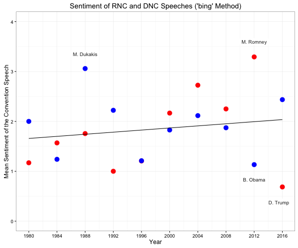

# Republican and Democratic National Convention Speech Sentiment Analysis

The project was inspired by an idea from my advisor, [Brian Todd](http://toddlab.ucdavis.edu/btodd.html), to look at the sentiment of presidential nominees' convention speeches. Working with speech texts compiled from [The American Presidency Project](http://www.presidency.ucsb.edu/nomination.php) and sentiment analysis methods modified from [Julia Silge](http://juliasilge.com/blog/If-I-Loved-NLP-Less/), we focus on Trump and Clinton's 2016 convention speeches but also analyze speeches dating back to 1980.

For a brief preview, see some of the main results:
  

  

  

  
### Repository Contents

- The .R script file contains all of the analysis code
- The .Rmd file is used to render the .pdf file, which contains plots of the sentiment data and our commentary
- The 'speeches' directory contains .txt files of all the convention speeches, as compiled from The American Presidency Project
- The 'plots' directory contains all of the plots output from this analysis, including those from speeches not shown in the .pdf write up
